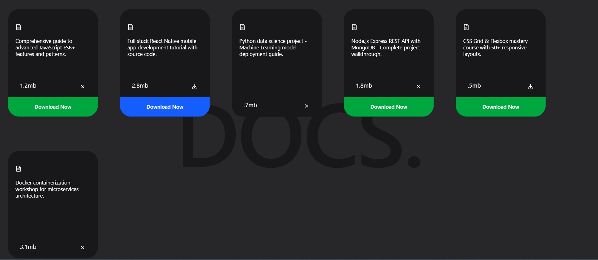

📝 Draggable Notes App (React)

A modern and interactive Draggable Notes Application built using React.js.
This app allows users to create, move, and manage notes freely on the screen using drag-and-drop functionality.

🚀 Features

✨ Create multiple notes dynamically

🖱️ Drag and reposition notes anywhere on the screen

🎨 Clean and modern UI

⚡ Smooth drag animations

📱 Responsive design

🧠 Built using functional components and React hooks

🛠️ Tech Stack

React.js

JavaScript (ES6+)

CSS3

React Hooks (useState, useEffect)

Drag functionality (custom or library-based)

Clone the repository

git clone https://github.com/your-username/drag-notes-app.git

Navigate to the project folder

cd drag-notes-app

Install dependencies

npm install

Start the development server

npm start

🖼️ Result Screenshots
 
 
💡 How It Works

Users can create notes dynamically.

Each note is rendered as a draggable component.

Drag events update the position state of each note.

React re-renders the component smoothly to reflect movement.